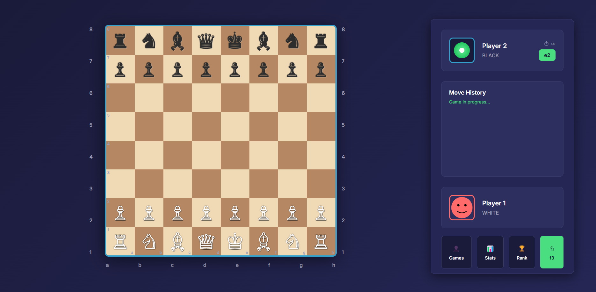

# Chess Game ♟️

A modern, responsive chess game built with vanilla HTML5, CSS3, and JavaScript. Features a sleek dark theme UI inspired by modern chess platforms like Chess.com and Lichess.



## ✨ Features

- ♟️ **Full Chess Gameplay** - Complete implementation of chess rules including castling, en passant, and pawn promotion
- 🎨 **Modern Dark Theme** - Beautiful UI with smooth animations and transitions
- 👥 **2-Player Local Mode** - Play against a friend on the same device
- 📱 **Responsive Design** - Works perfectly on desktop, tablet, and mobile devices
- 🎯 **Move Validation** - Complete move validation and game state management
- 👑 **Game States** - Checkmate, stalemate, and draw detection
- 📝 **Move History** - Track all moves with algebraic notation
- 🎵 **Sound Effects** - Audio feedback for moves and captures
- ⏱️ **Timer Support** - Ready for time controls (infinite time by default)
- 🎮 **Keyboard Shortcuts** - Quick access to common actions

## 🚀 Live Demo

[Play Chess Game Online](https://your-demo-link.com) *(Coming Soon)*

## 🎮 How to Play

1. **Start Game**: White pieces move first (player at bottom)
2. **Make Moves**: Click on a piece to select it, then click on a valid square to move
3. **Turn-based**: Players alternate turns automatically
4. **Special Moves**: All chess rules are implemented including castling, en passant, and pawn promotion
5. **Win Conditions**: Game ends on checkmate, stalemate, or draw by insufficient material

### Keyboard Shortcuts

- `Ctrl/Cmd + N` - New Game
- `Ctrl/Cmd + Z` - Undo Move
- `H` - Show Hint
- `F` - Flip Board
- `Esc` - Clear Selection

## 🛠️ Getting Started

### Prerequisites

- Modern web browser (Chrome, Firefox, Safari, Edge)
- Local web server (optional, for development)

### Installation

1. **Clone the repository:**
```bash
git clone https://github.com/yourusername/chess-game.git
cd chess-game
```

2. **Run locally:**

**Option A: Simple file serving**
```bash
# Just open index.html in your browser
open index.html
```

**Option B: Local web server (recommended)**
```bash
# Using Python
python -m http.server 8000

# Using Node.js (http-server)
npx http-server

# Using PHP
php -S localhost:8000
```

3. **Navigate to `http://localhost:8000` in your browser**

## 📁 Project Structure

```
chess-game/
├── index.html              # Main HTML file
├── css/
│   ├── styles.css          # Main styles and layout
│   ├── board.css           # Chess board styles
│   └── pieces.css          # Chess pieces styles
├── js/
│   ├── main.js             # Application initialization
│   ├── game.js             # Game state management
│   ├── board.js            # Board rendering and interaction
│   ├── pieces.js           # Piece definitions and move validation
│   └── utils.js            # Utility functions
├── assets/                 # Static assets (images, sounds)
├── docs/                   # Documentation
├── README.md              # This file
├── LICENSE               # MIT License
└── package.json         # Project metadata
```

## 🎯 Game Logic

### Core Components

- **ChessGame**: Main game controller managing state, turns, and rules
- **ChessBoard**: Board rendering, piece movement, and visual effects
- **ChessPiece**: Individual piece logic and valid move calculation
- **MoveValidator**: Move validation, check/checkmate detection
- **PieceFactory**: Initial board setup and piece creation

### Movement Rules

All standard chess rules are implemented:

- ✅ Piece-specific movement patterns
- ✅ Capture mechanics
- ✅ Check and checkmate detection
- ✅ Castling (kingside and queenside)
- ✅ En passant captures
- ✅ Pawn promotion
- ✅ Stalemate detection
- ✅ Draw by insufficient material

## 🎨 Customization

### Themes

The game uses CSS custom properties for easy theming:

```css
:root {
    --bg-primary: #1a1b3a;
    --bg-secondary: #252654;
    --accent-primary: #33a1cc;
    --accent-secondary: #4ade80;
    --text-primary: #ffffff;
    /* ... more variables */
}
```

### Adding New Features

The modular architecture makes it easy to extend:

1. **AI Opponent**: Implement minimax algorithm in a new `ChessAI` class
2. **Online Multiplayer**: Add WebSocket support for real-time games
3. **Game Analysis**: Extend move history with evaluation and suggestions
4. **Time Controls**: Implement chess clocks and time management

## 🧪 Development

### Code Style

- ES6+ JavaScript features
- Modular class-based architecture
- Consistent naming conventions
- Comprehensive commenting
- Separation of concerns

### Testing

```bash
# Run tests (when available)
npm test

# Lint code
npm run lint
```

## 🤝 Contributing

Contributions are welcome! Please feel free to submit a Pull Request. For major changes, please open an issue first to discuss what you would like to change.

### Development Setup

1. Fork the repository
2. Create a feature branch (`git checkout -b feature/amazing-feature`)
3. Make your changes
4. Test thoroughly
5. Commit your changes (`git commit -m 'Add amazing feature'`)
6. Push to the branch (`git push origin feature/amazing-feature`)
7. Open a Pull Request

### Feature Roadmap

- [ ] AI opponent with adjustable difficulty
- [ ] Online multiplayer with WebRTC
- [ ] Game analysis and move suggestions
- [ ] Tournament mode
- [ ] Custom themes and board styles
- [ ] Sound effect customization
- [ ] Mobile app version
- [ ] Chess puzzle mode
- [ ] Game database and statistics

## 📄 License

This project is licensed under the MIT License - see the [LICENSE](LICENSE) file for details.

## 🙏 Acknowledgments

- Chess piece designs using Unicode chess symbols
- UI/UX inspired by Chess.com and Lichess
- Built with vanilla JavaScript for performance and simplicity
- Modern CSS Grid and Flexbox for responsive layout

## 📞 Contact

Your Name - [your.email@example.com](mailto:your.email@example.com)

Project Link: [https://github.com/yourusername/chess-game](https://github.com/yourusername/chess-game)

---

**Made with ❤️ and ♟️**
